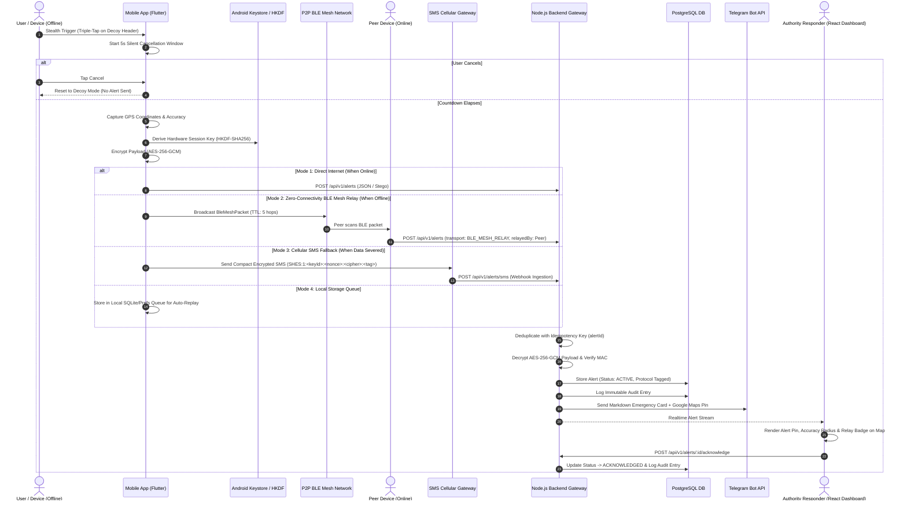

# SheSecure System Architecture

SheSecure is a production-grade covert emergency communication and response platform designed for high-risk situations. It enables silent distress triggers, zero-knowledge payload encryption, hardware-derived key protection (HSM / Android Keystore), peer-to-peer Bluetooth Low Energy (BLE) mesh routing, automated SMS cellular fallback, covert steganographic transmission, resilient offline persistence with automatic retry, and authoritative situational response.

---

## 1. High-Level Multi-Path Emergency Flow Diagram

---

## 2. Advanced Resiliency & Security Pillars

### 2.1 Peer-to-Peer BLE Mesh Relay (`BleMeshRelayService`)
* **Decentralized Multi-Hop Routing**: Operates with a default 5-hop Time-To-Live (TTL).
* **Loop Prevention**: Implements an LRU cache of recently seen packet IDs and alert IDs to prevent broadcast storms.
* **Auto-Bridging Gateway**: Any nearby peer device running SheSecure with active internet connectivity automatically forwards received mesh packets to the backend API.

### 2.2 Hardware Security Module / Android Keystore (`KeystoreService`)
* **Hardware-Backed Storage**: Root cryptographic seeds stored in Android Keystore (`EncryptedSharedPreferences`) or iOS Keychain.
* **HKDF-SHA256 Key Derivation**: Derives unique, ephemeral 256-bit encryption keys per incident session context (`shesecure:alert:<alertId>:<deviceId>`).

### 2.3 Automated SMS Fallback Gateway (`SmsFallbackService`)
* **Compact Framing Protocol**: `SHES:1:<keyId>:<nonce_b64>:<ciphertext_b64>:<tag_b64>`.
* **Zero Data Dependency**: Dispatches distress telemetry over standard GSM/cellular SMS when data and mesh peers are unavailable.
* **Backend Webhook Ingestion**: Endpoint `POST /api/v1/alerts/sms` ingests and processes SMS-transmitted distress signals.
